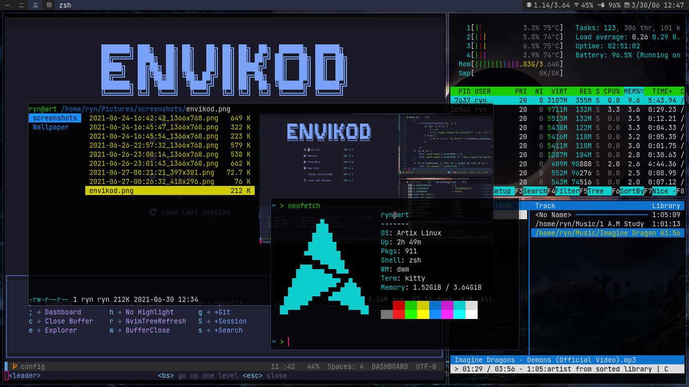

My Minimalist Desk Setup
========================

Dependencies
------------

 - `dmenu` → To generate the applications menu.
 - `feh` → The image viewer and to add the wallpaper.
 - `networkmanger` → To manage network over wifi connection
 - `dwm` → The window manager.
 - `picom` → To add shadow under windows.
 - `qutebrowser` → The web browser.
 - `scrot` → The screen capture utility.
 - `ranger` → The file explorer.
 - `JetBrains Mono` → The font i used
 - `nvim` → The code editor.
 - `kitty` → The terminal emulator.

Contact me if need help about this config.
